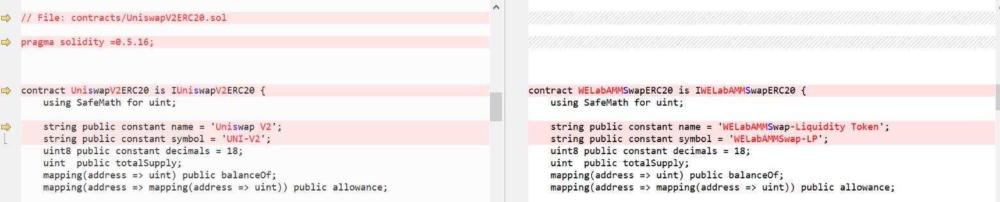
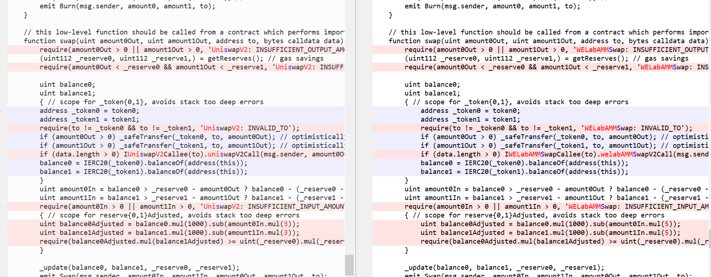
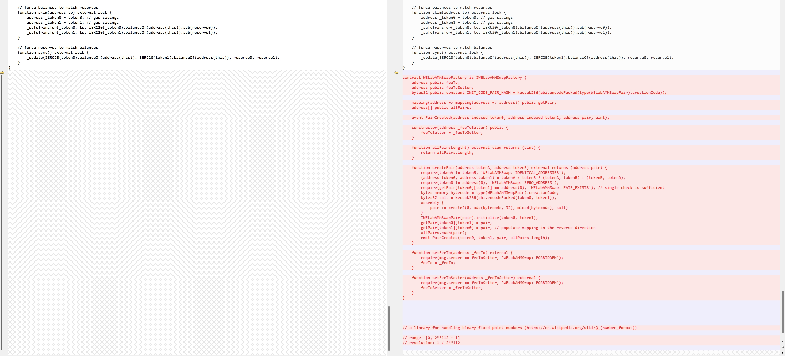
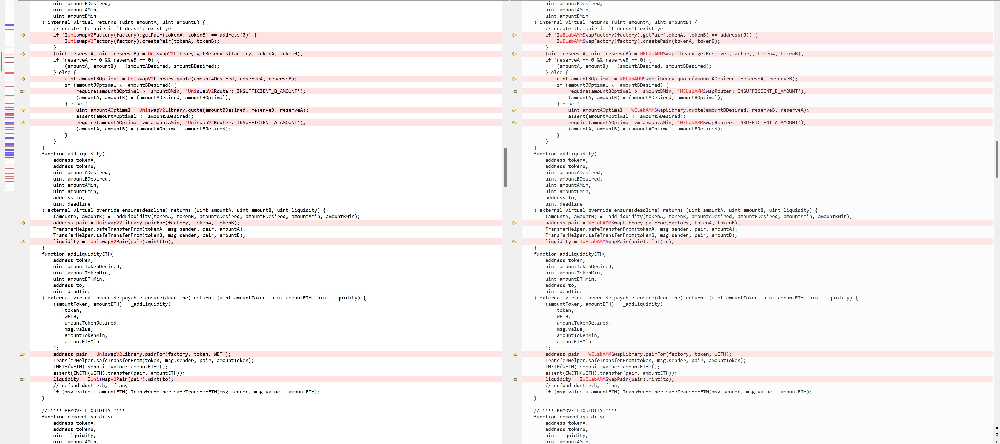
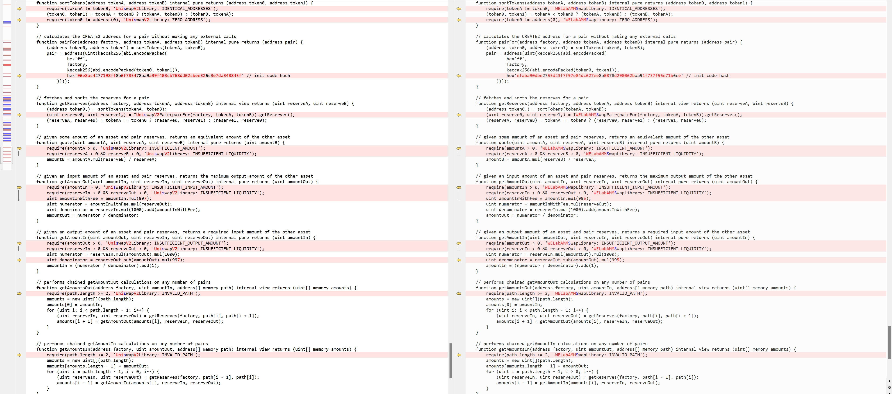

# WELabs_AMM_Swap_UniSwap_Similarity_Analysis

## Purpose

The primary objective of this analysis is to assess the code similarity between the **[source repo](#source)** and the **[target repo](#target)**.

Our engineering team has embarked on a detailed direct comparison of the code repositories. This examination aims to
accurately quantify and understand the extent of similarity.

Our analysis result can be found in the **[conclusion](#conclusion)**.

## Code Repos

#### Source

* https://github.com/WELabsPerpCodeBase/AMM-Swap
    * commit hash: `34b4a88546cb53ea40f1f2d8e56790e4de7a775d`
      * [router.sol](https://github.com/WELabsPerpCodeBase/AMM-Swap/blob/34b4a88546cb53ea40f1f2d8e56790e4de7a775d/contracts/core/router.sol)
      * [factory.sol](https://github.com/WELabsPerpCodeBase/AMM-Swap/blob/34b4a88546cb53ea40f1f2d8e56790e4de7a775d/contracts/core/factory.sol)

#### Target

* https://etherscan.io/address/0x7a250d5630b4cf539739df2c5dacb4c659f2488d#code
    * `0x7a250d5630b4cf539739df2c5dacb4c659f2488d`
* https://etherscan.io/address/0x074b735db7a27cf0d68f0eba6769b4c751cfc23d#code
    * `0x074b735db7a27cf0d68f0eba6769b4c751cfc23d`

A copy of the codes has also been cloned into [source_code/](source_code/) and [target_code/](target_code/) for
reference.

## Conclusion

Based on our comparison, we conclude that the source and the target are: **Nearly Identical** with a new contract added `WELabAMMSwapFactory`.

The majority of changes are:
1. Function renames
2. Variable renames
3. Fee change
4. New contract WELabAMMSwapFactory - the added code has been extract to a file in [results/WELabAMMSwapFactory.sol](results/WELabAMMSwapFactory.sol)

With proper execution, the WELabs_AMM_Swap protocol should perform in very similar ways to Uniswap V2. Prior security assessments on target repos can be a good
reference. Readers of this analysis, based on your security requirements, should determine on their own whether or not
to directly trust the prior or existing security assessments or audits on target repos.

## Methodology for Similarity Comparison

In our approach, we primarily employed the fundamental algorithm underlying the `diff` utility to ascertain the degree
of similarity at the string level between the source and target repos.

The `diff` utility, widely used in text comparison and analysis, operates on the principle of finding the longest common
subsequence (LCS) between two sets of data, typically text files:

1. Longest Common Subsequence (LCS): The LCS is the heart of the diff algorithm. It finds the longest sequence of
   characters that appear in the same order in both files. Unlike substrings, the characters in a subsequence are not
   required to occupy consecutive positions. The LCS serves as a baseline for understanding the similarities between two
   files.
2. Differences Identification: After determining the LCS, diff analyzes the sections of the files that don't form part
   of this subsequence. These segments are the differences or changes. The algorithm efficiently pinpoints where the two
   files diverge from the LCS, marking these as either additions, deletions, or modifications.

The screenshots are from Beyond Compare for better visualization.

Tools used:

* `diff` - https://ss64.com/osx/diff.html
* DiffMerge: https://sourcegear.com/diffmerge/
* Beyond Compare: https://www.scootersoftware.com/

## Comparison Detail

#### Diff Compare -> factory.sol

* Diff:
    * [source_code/AMM-Swap/contracts/core/factory.sol](source_code/AMM-Swap/contracts/core/factory.sol)
    * [target_code/uniswap-v2/UniswapV2Pair.sol](target_code/uniswap-v2/UniswapV2Pair.sol)
* Output: [./results/AMM-Swap/contracts/core/factory.sol.patch](./results/AMM-Swap/contracts/core/factory.sol.diff.patch)

```bash
$ diff ./source_code/AMM-Swap/contracts/core/factory.sol ./target_code/uniswap-v2/UniswapV2Pair.sol > ./results/AMM-Swap/contracts/core/factory.sol.diff.patch
```

Main changes:

1. file renames
2. variable and function renames
3. add a contract WELabAMMSwapFactory with 38 newlines.

Screenshot from Beyond Compare for Reference:

- ./source_code/AMM-Swap/contracts/core/factory.sol   
**TIPS**: The result has already made several contracts in factory.sol change their locations.
  
  
  
  

cloc compare

`$ cloc --by-file --diff source_code/AMM-Swap/contracts/core/factory.sol target_code/uniswap-v2/UniswapV2Pair.sol --include-ext=sol`
```
       1 text file.
       1 text file.

github.com/AlDanial/cloc v 1.90  T=0.07 s (53.7 files/s, 5946.5 lines/s)
--------------------------------------------------------------------------------------------------
File                                                         blank        comment           code
--------------------------------------------------------------------------------------------------
source_code/AMM-Swap/contracts/core/factory.sol
 same                                                            0             15            324
 modified                                                        0              3             35
 added                                                           6             10              9
 removed                                                         0              3             38
--------------------------------------------------------------------------------------------------
SUM:
 same                                                            0             15            324
 modified                                                        0              3             35
 added                                                           6             10              9
 removed                                                         0              3             38
--------------------------------------------------------------------------------------------------
```

#### Diff Compare -> router.sol

* Diff:
    * [source_code/AMM-Swap/contracts/core/router.sol](source_code/AMM-Swap/contracts/core/router.sol)
    * [target_code/uniswap-v2/UniswapV2Router02.sol](target_code/uniswap-v2/UniswapV2Router02.sol)
* Output: [./results/AMM-Swap/contracts/core/router.sol.patch](./results/AMM-Swap/contracts/core/router.sol.diff.patch)

```bash
$ diff ./source_code/AMM-Swap/contracts/core/router.sol ./target_code/uniswap-v2/UniswapV2Router02.sol > ./results/AMM-Swap/contracts/core/router.sol.diff.patch
```

Main changes:

1. file renames
2. variable and function renames

beyond_compare result./source_code/AMM-Swap/contracts/core/router.sol  




cloc compare

`$ cloc --by-file --diff source_code/AMM-Swap/contracts/core/router.sol target_code/uniswap-v2/UniswapV2Router02.sol --include-ext=sol`
```
       1 text file.
       1 text file.
       0 files ignored.                             

github.com/AlDanial/cloc v 1.90  T=0.07 s (53.7 files/s, 9792.7 lines/s)
-------------------------------------------------------------------------------------------------
File                                                        blank        comment           code
-------------------------------------------------------------------------------------------------
source_code/AMM-Swap/contracts/core/router.sol
 same                                                           0             24            551
 modified                                                       0              0            150
 added                                                          0              0              0
 removed                                                        1              3              0
-------------------------------------------------------------------------------------------------
SUM:
 same                                                           0             24            551
 modified                                                       0              0            150
 added                                                          0              0              0
 removed                                                        1              3              0
-------------------------------------------------------------------------------------------------
```
